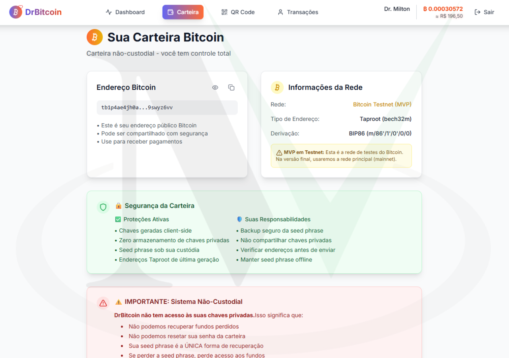
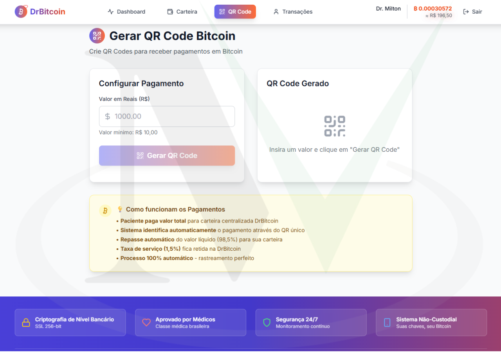
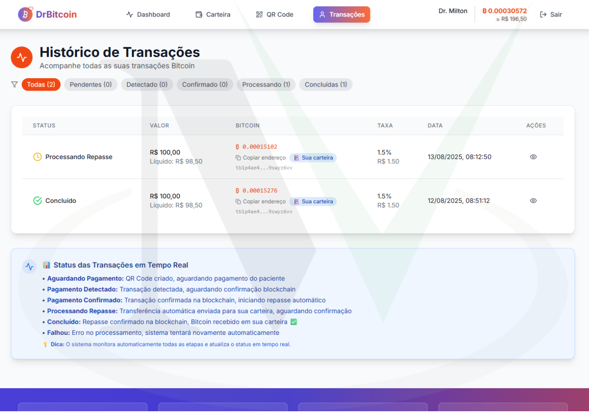
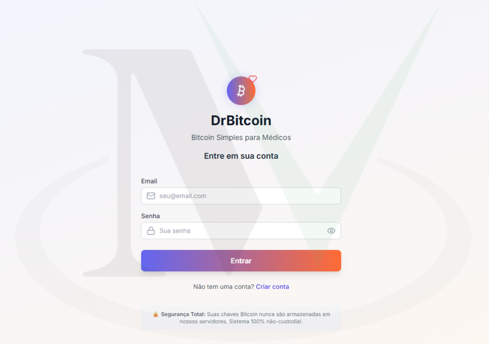
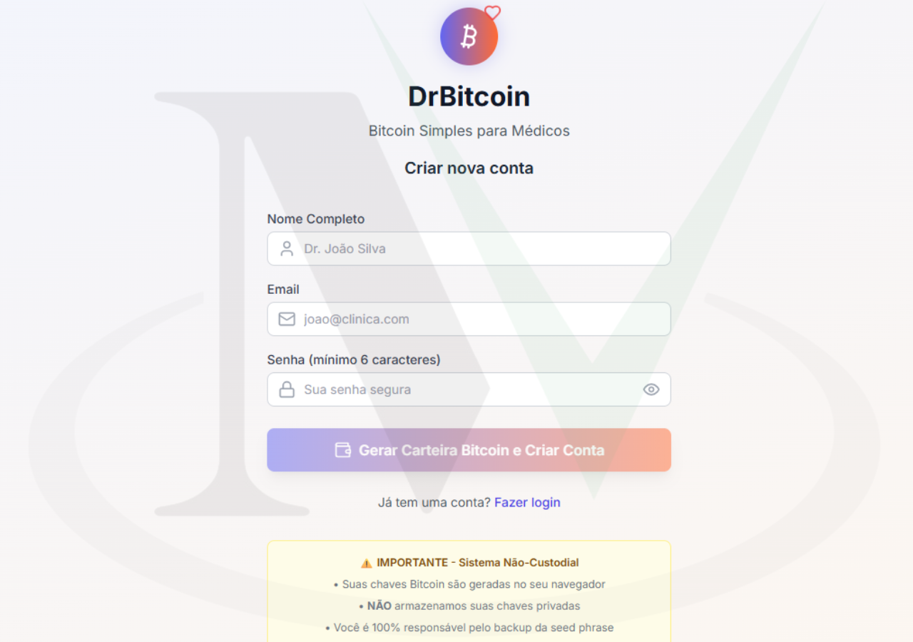
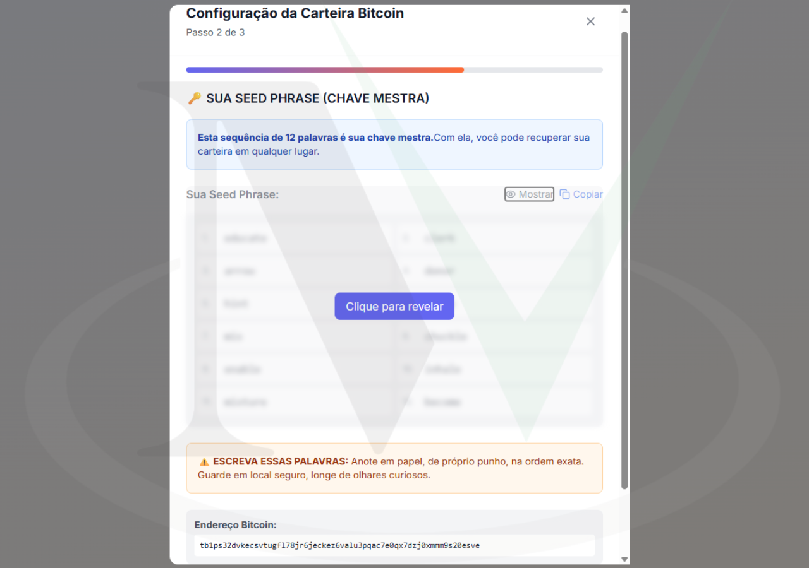
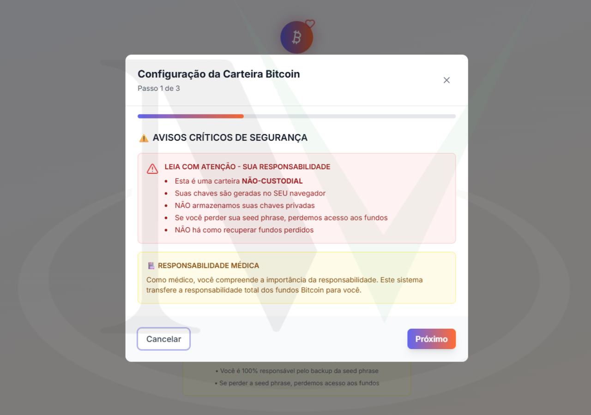
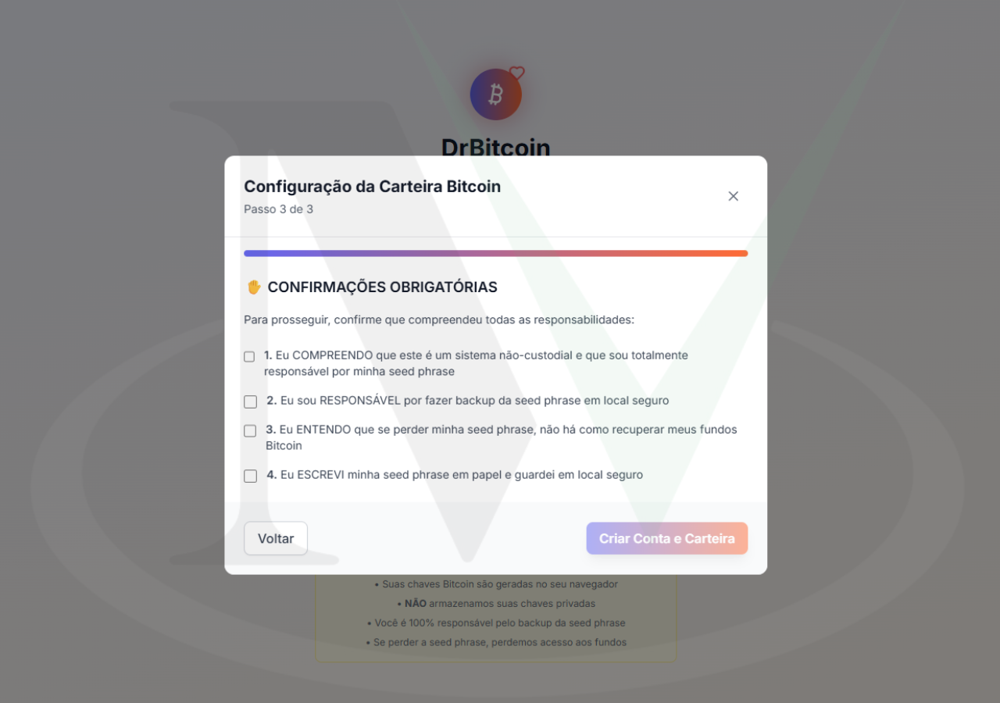
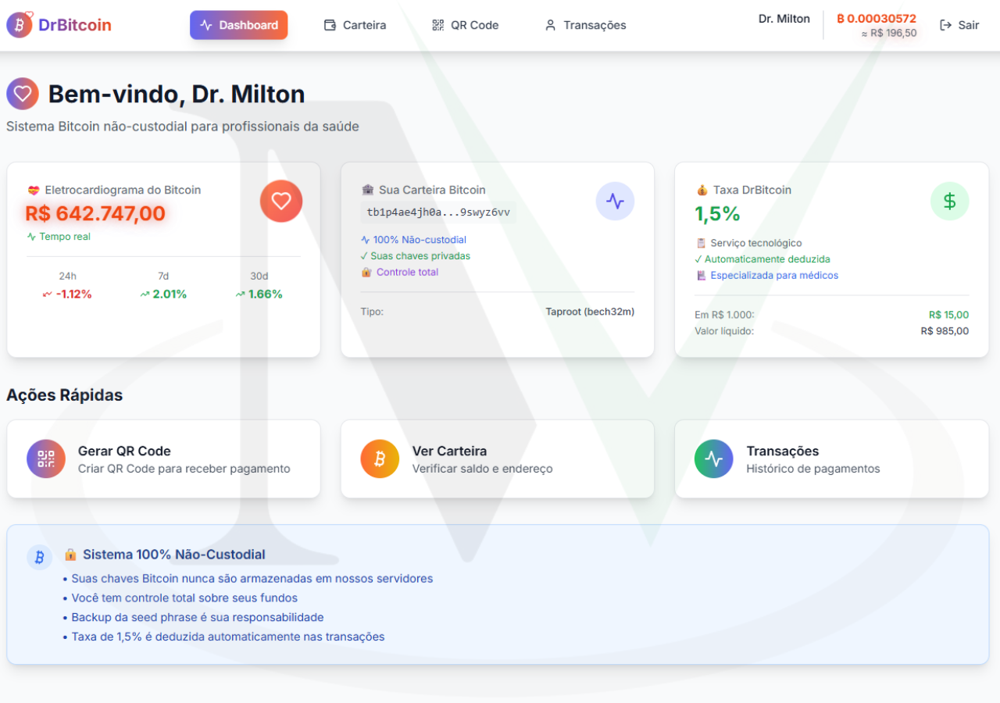

  <!-- Languages: -->
  <a title="Português" href="README_ptbr.md">🇧🇷 Português</a>

# DrBitcoin 🩺₿

**DrBitcoin** is a centralized Bitcoin payment system designed specifically for Brazilian medical professionals, enabling secure Bitcoin payments with automatic fee processing and perfect transaction tracking.

---

## Features ✨

- **Centralized Payment Gateway** 🎯: All payments flow through company wallet for perfect tracking
- **Automatic Distribution** 💸: 98.5% automatically transferred to doctor, 1.5% platform fee
- **Non-Custodial Doctor Wallets** 🔒: Doctors maintain full control of their Bitcoin wallets
- **Real-time Blockchain Monitoring** ⚡: Payment detection every 30 seconds
- **Unique QR Code System** 📱: Each transaction has unique identifier for zero ambiguity
- **Complete Tax Compliance** 📊: Perfect transaction history for accounting purposes

---

## Technologies Used 🛠️

### Backend
- **Node.js + Express** 🚀: High-performance API server with TypeScript
- **Prisma + SQLite** 💾: Type-safe ORM with embedded database
- **BitcoinJS-lib** ₿: Industry-standard Bitcoin library for wallet operations
- **JWT Authentication** 🔒: Secure token-based authentication

### Frontend
- **React 18 + Vite** ⚛️: Modern reactive UI with lightning-fast builds
- **TypeScript** 📘: End-to-end type safety across the application
- **Tailwind CSS** 🎨: Utility-first CSS framework for rapid UI development
- **Zustand** 🐻: Lightweight state management solution

### Bitcoin Integration
- **BIP39/BIP84** 🔑: Standard Bitcoin wallet generation protocols
- **Mempool.space API** ⛓️: Real-time blockchain monitoring
- **CoinGecko API** 📈: Live BTC/BRL price feeds
- **SegWit (bech32)** 🏷️: Modern Bitcoin address format for lower fees

---

## Payment Flow 💰

### Transaction Process
1. **QR Generation**: Doctor creates payment request with unique identifier
2. **Patient Payment**: Sends Bitcoin to company's centralized address
3. **Automatic Detection**: System identifies payment by amount and timing
4. **Instant Transfer**: 98.5% sent to doctor, 1.5% retained as fee
5. **Complete Tracking**: Full transaction history with blockchain proof

### Fee Structure
- **Doctor Receives**: 98.5% of total payment
- **Platform Fee**: 1.5% for technological service
- **Transfer Speed**: Minutes after blockchain confirmation
- **Network Fees**: Optimized using SegWit addresses

---

## Architecture 🏗️

### Monorepo Structure
- **apps/backend**: Node.js API with payment monitoring system
- **apps/frontend**: React application with medical-focused UI
- **packages/bitcoin-utils**: Shared Bitcoin utilities and wallet generation
- **packages/shared-types**: TypeScript type definitions

### Security & Compliance
- **Non-custodial wallets**: Private keys never touch servers
- **Client-side generation**: Wallets created in user's browser
- **Encrypted storage**: Sensitive data encrypted at rest
- **Complete audit trail**: Every transaction logged and traceable

---

## Authors 👥

- **@miltonvo** 👨‍💻: Lead developer and system architect

---

## Demonstration 📺

|  |  |  |
|:------------------------:|:------------------------:|:------------------------:|
| Medical Dashboard | Bitcoin Wallet | Payment QR Code |

|  |  |  |
|:------------------------:|:------------------------:|:------------------------:|
| Transaction History | Login Screen | Registration Screen |

|  |  |  |
|:------------------------:|:------------------------:|:------------------------:|
| Wallet Creation | Wallet Configuration | Wallet Configuration |

### Video Demonstration 🎥

🔗 **Watch the system in action** ⬇️

---

📄 Full case study on the MV Dev Solutions website: [https://mvdevsolutions.com.br/en/projects/drbitcoin-bitcoin-payment-system-for-healthcare](https://mvdevsolutions.com.br/en/projects/drbitcoin-bitcoin-payment-system-for-healthcare)
