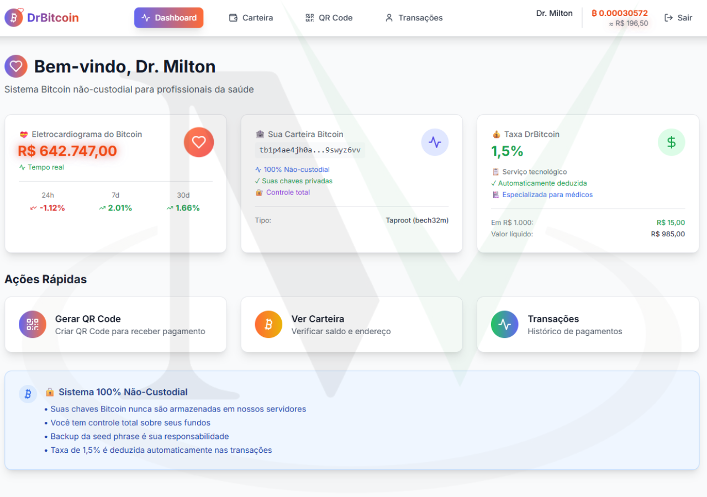
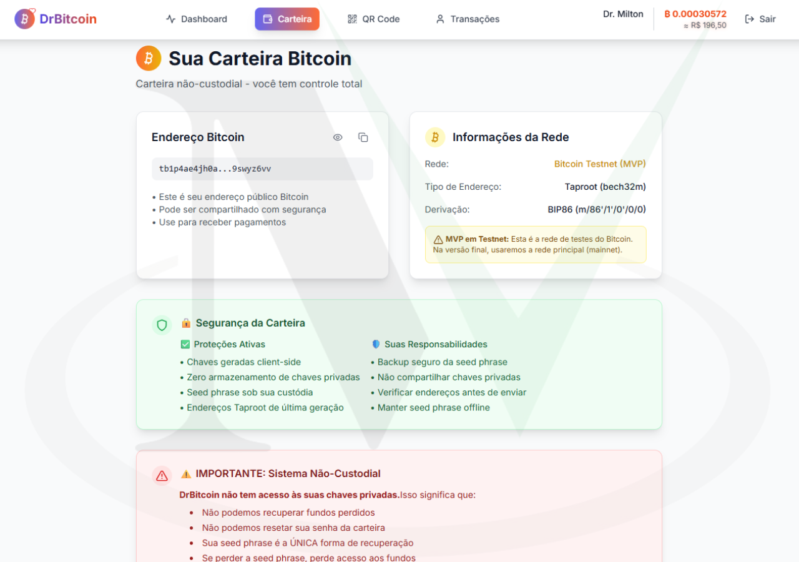
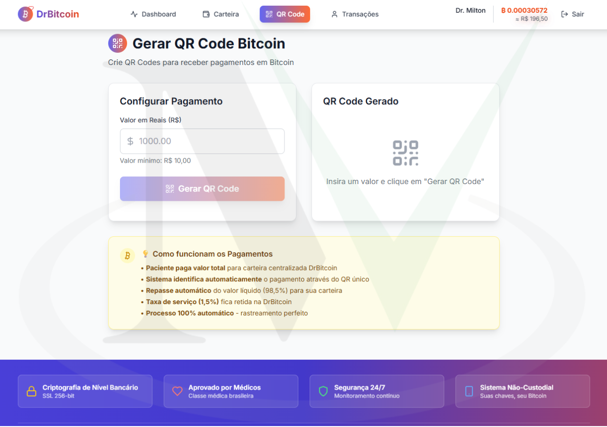
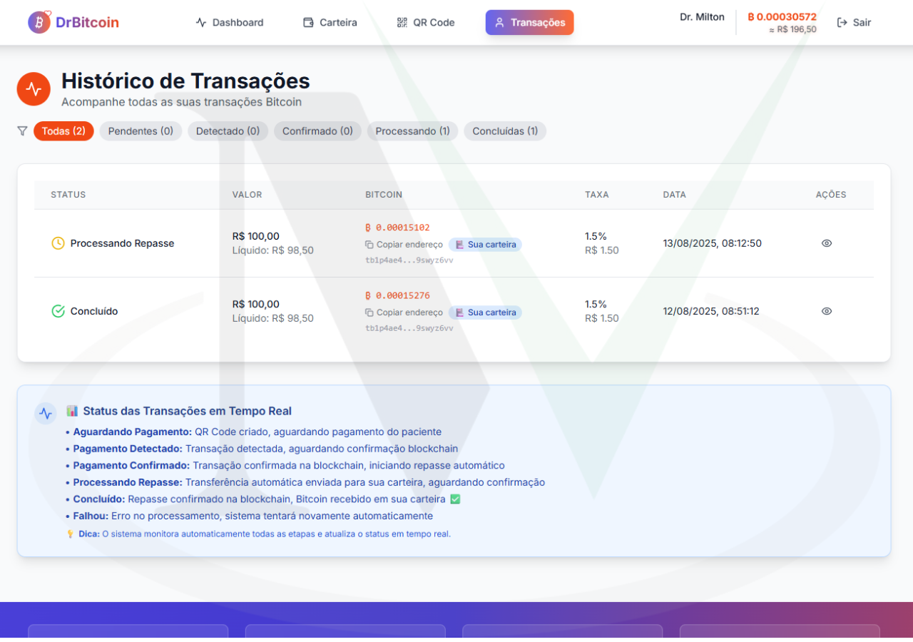
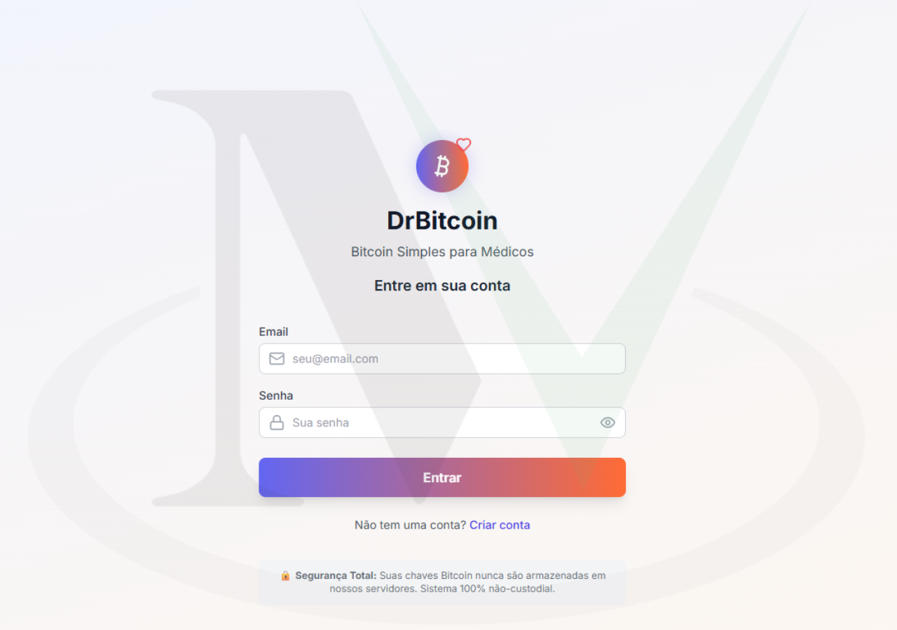
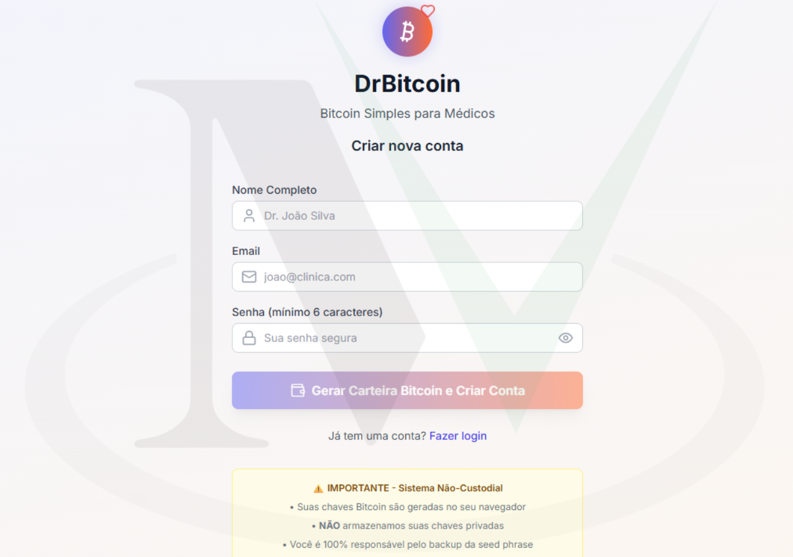
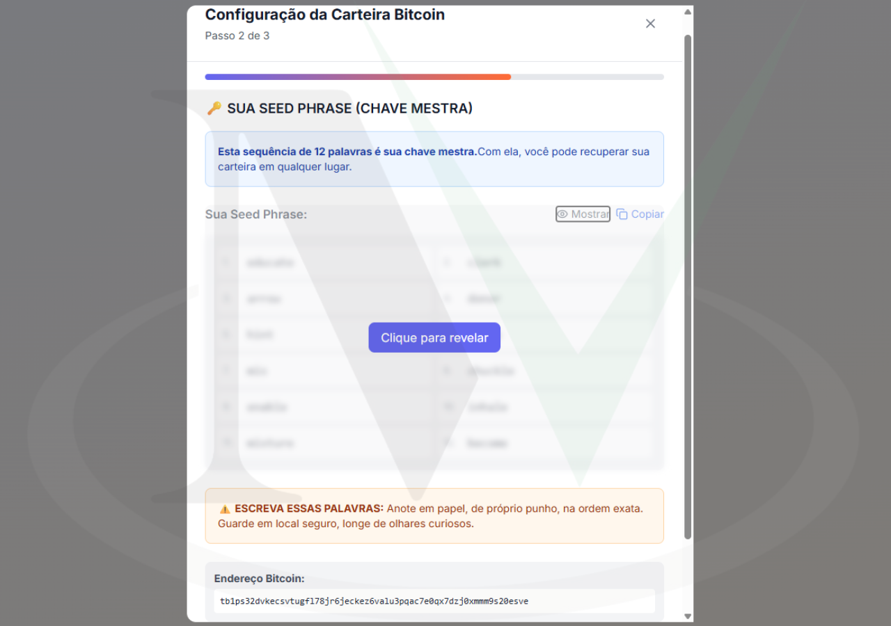
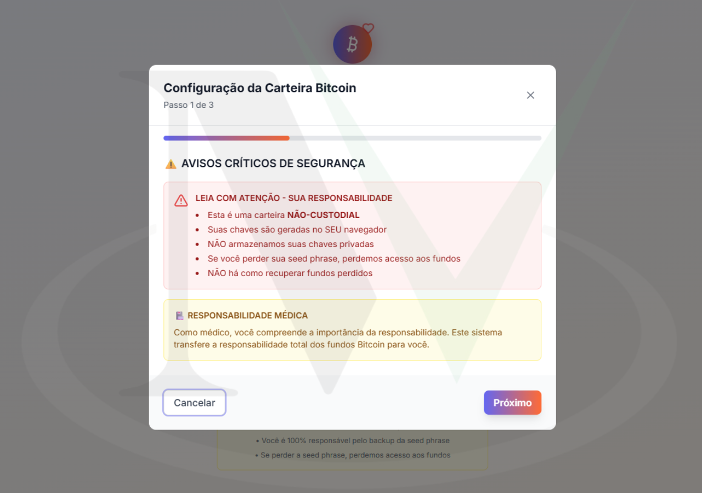
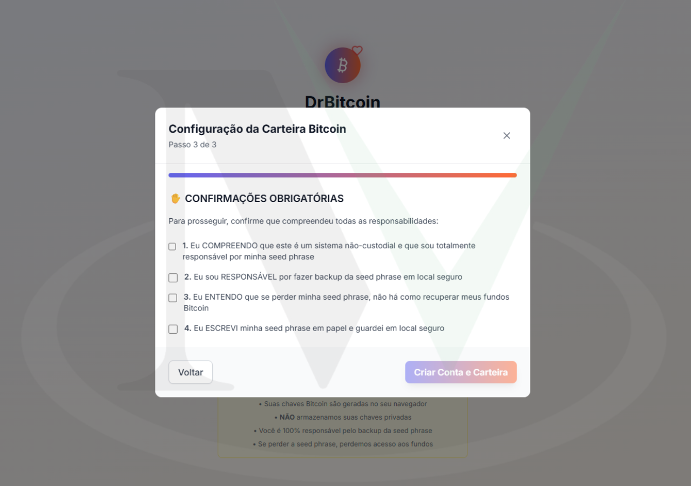

  <!-- Idiomas: -->
  <a title="English" href="README.md">🇺🇸 English</a>

# DrBitcoin 🩺₿

**DrBitcoin** é um sistema de pagamento Bitcoin centralizado projetado especificamente para profissionais médicos brasileiros, permitindo pagamentos seguros em Bitcoin com processamento automático de taxas e rastreamento perfeito de transações.

---

## Funcionalidades ✨

- **Gateway de Pagamento Centralizado** 🎯: Todos os pagamentos fluem pela carteira da empresa para rastreamento perfeito
- **Distribuição Automática** 💸: 98,5% automaticamente transferido ao médico, 1,5% de taxa da plataforma
- **Carteiras Não-Custodiais para Médicos** 🔒: Médicos mantêm controle total de suas carteiras Bitcoin
- **Monitoramento Blockchain em Tempo Real** ⚡: Detecção de pagamentos a cada 30 segundos
- **Sistema de QR Code Único** 📱: Cada transação tem identificador único para zero ambiguidade
- **Conformidade Fiscal Completa** 📊: Histórico perfeito de transações para fins contábeis

---

## Tecnologias Utilizadas 🛠️

### Backend
- **Node.js + Express** 🚀: Servidor API de alta performance com TypeScript
- **Prisma + SQLite** 💾: ORM type-safe com banco de dados embarcado
- **BitcoinJS-lib** ₿: Biblioteca Bitcoin padrão da indústria para operações de carteira
- **Autenticação JWT** 🔒: Autenticação segura baseada em tokens

### Frontend
- **React 18 + Vite** ⚛️: UI reativa moderna com builds ultra-rápidos
- **TypeScript** 📘: Segurança de tipos end-to-end em toda a aplicação
- **Tailwind CSS** 🎨: Framework CSS utility-first para desenvolvimento rápido de UI
- **Zustand** 🐻: Solução leve de gerenciamento de estado

### Integração Bitcoin
- **BIP39/BIP84** 🔑: Protocolos padrão de geração de carteira Bitcoin
- **API Mempool.space** ⛓️: Monitoramento blockchain em tempo real
- **API CoinGecko** 📈: Feeds de preço BTC/BRL ao vivo
- **SegWit (bech32)** 🏷️: Formato moderno de endereço Bitcoin para taxas menores

---

## Fluxo de Pagamento 💰

### Processo de Transação
1. **Geração de QR**: Médico cria solicitação de pagamento com identificador único
2. **Pagamento do Paciente**: Envia Bitcoin para endereço centralizado da empresa
3. **Detecção Automática**: Sistema identifica pagamento por valor e timing
4. **Transferência Instantânea**: 98,5% enviado ao médico, 1,5% retido como taxa
5. **Rastreamento Completo**: Histórico completo de transações com prova blockchain

### Estrutura de Taxas
- **Médico Recebe**: 98,5% do pagamento total
- **Taxa da Plataforma**: 1,5% pelo serviço tecnológico
- **Velocidade de Transferência**: Minutos após confirmação blockchain
- **Taxas de Rede**: Otimizadas usando endereços SegWit

---

## Arquitetura 🏗️

### Estrutura Monorepo
- **apps/backend**: API Node.js com sistema de monitoramento de pagamentos
- **apps/frontend**: Aplicação React com UI focada no setor médico
- **packages/bitcoin-utils**: Utilitários Bitcoin compartilhados e geração de carteiras
- **packages/shared-types**: Definições de tipos TypeScript

### Segurança & Conformidade
- **Carteiras não-custodiais**: Chaves privadas nunca tocam os servidores
- **Geração client-side**: Carteiras criadas no navegador do usuário
- **Armazenamento criptografado**: Dados sensíveis criptografados em repouso
- **Trilha de auditoria completa**: Cada transação registrada e rastreável

---

## Autores 👥

- **@miltonvo** 👨‍💻: Desenvolvedor principal e arquiteto do sistema

---

## Demonstração 📺

|  |  |  |
|:------------------------:|:------------------------:|:------------------------:|
| Login & Cadastro | Dashboard Médico | QR Code de Pagamento |

|  |  |  |
|:------------------------:|:------------------------:|:------------------------:|
| Histórico de Transações | Carteira Bitcoin | Processo de Pagamento |

|  |  |  |
|:------------------------:|:------------------------:|:------------------------:|
| Responsivo Mobile | Painel Admin | Configurações do Sistema |

### Vídeo Demonstração 🎥

🔗 **Veja o sistema em ação** ⬇️

